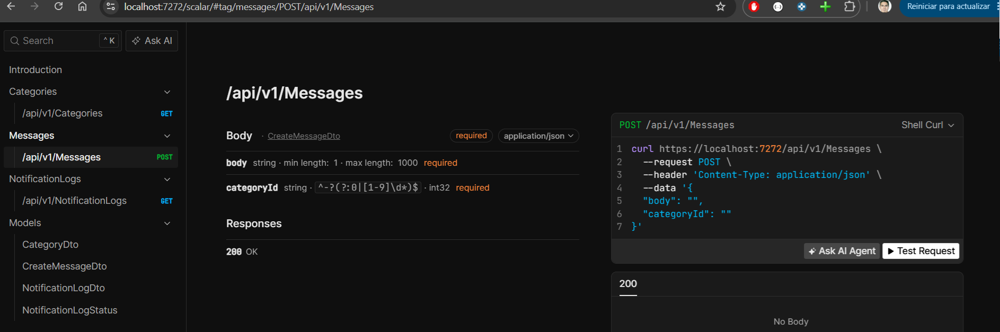
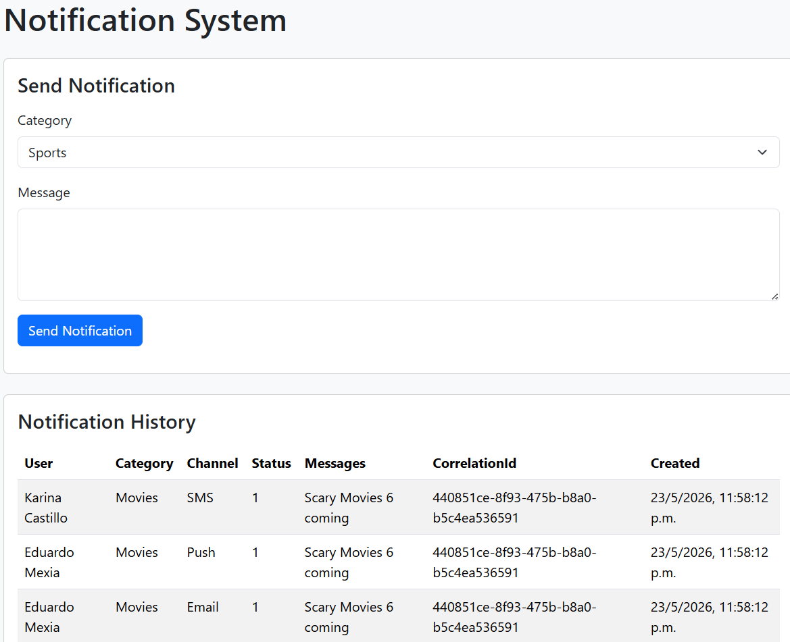

# Notification System Challenge

A notification dispatching system built with ASP.NET Core using Clean Architecture principles.

The application allows:
- Creating notification messages by category
- Dispatching notifications to subscribed users
- Supporting multiple notification channels (Email, SMS, Push)
- Tracking notification history and failures

# Changes Since Initial Submission

Based on reviewer feedback, the following were addressed:

- **Async notification processing**: messages are now enqueued and dispatched asynchronously via `INotificationQueue` + `NotificationWorker` (BackgroundService), decoupling the API request from notification delivery.
- **Fault tolerance**: each channel send retries up to 3 times with backoff; failures are logged per-channel without affecting other channels/users; the worker survives a failed job and continues processing the queue.
- **Unit test coverage**: expanded to cover the queue, worker, job processor, dispatcher (including retry, multi-channel, and unsupported-channel scenarios), and message validation edge cases (whitespace body, nonexistent category).
- **Pluggable messaging transport**: messages are published through an `INotificationPublisher` abstraction whose implementation is selected at startup via `Messaging:Provider`. Ships with the in-memory queue (default) and a durable **RabbitMQ** transport (dead-letter queue included), with no changes required in the Application/Domain layers to switch.
- **Docker support**: a `docker-compose.yml` starts RabbitMQ (with management UI) for local development.

# Architecture

The solution follows Clean Architecture principles:

- Domain
  - Entities (database tables for categories, messages, notificationlogs)
  - Enums (channeltype, notificationlogstatus)

- Application
  - Services (Implementation of services for categories, messages, notificationlogs, dispatcher)
  - DTOs (category, message, notificationlog)
  - Abstractions (Interface services for categories, messages, notificationlogs, dispatcher, inotificationqueue, job processor)
  - Models (message sent result)

- Infrastructure
  - Persistence
	- Migrations
	- Seeders (for channels, users, categories)
	- DbContext (database context)
  - Repositories (implementation of repositories for categories, messages, notificationlogs)
  - Notification channels (implementations of email, sms, push notification channels)
  - Queue (in-memory notification queue and hosted worker for async dispatch)
    - NotificationJobProcessor: processes a single job (fetch message, dispatch notifications)
    - NotificationWorker: drains the queue and ensures one job's failure doesn't stop subsequent jobs from being processed
  - Messaging (pluggable transport behind `INotificationPublisher`)
    - InMemory: publisher that delegates to the in-process queue above
    - RabbitMq: durable publisher + consumer (`BackgroundService`), topology with a dead-letter exchange/queue, selected via `Messaging:Provider`
  
- Api
  - Controllers (for categories, messages, notificationlogs)
  - Dependency injection

# Design Decisions

## Notification Queue and Background Worker

An in-memory notification queue was implemented to decouple message creation from dispatching. `INotificationQueue` recieves the message, add to the queue and a background worker processes the queue, dispatching notifications asynchronously. This allows for better scalability and responsiveness.

Cons: if the app crashes or restarts, pending notifications in the queue will be lost. For production, a persistent broker is recommended — which is why the transport is now pluggable (see below).

Worker is implemented using `BackgroundService` and runs in the same process as the API for simplicity. In a real-world scenario, it could be hosted as an Azure Function, AWS Lambda, or a separate worker service.

## Pluggable Messaging Transport

Message production goes through a single `INotificationPublisher` abstraction; the consumer side is a transport-specific hosted service. The implementation is chosen at startup from the `Messaging:Provider` setting, so the Application/Domain layers never depend on a broker.

| `Messaging:Provider` | Publisher | Consumer | Notes |
|----------------------|-----------|----------|-------|
| `InMemory` (default) | delegates to `System.Threading.Channels` | `NotificationWorker` | Single process, non-durable. Good for tests. |
| `RabbitMq`           | `RabbitMqNotificationPublisher` | `RabbitMqNotificationWorker` | Durable, survives restarts, scales horizontally. |

`appsettings.json` defaults to `InMemory`; `appsettings.Development.json` sets `RabbitMq` so it pairs with the Docker setup below. RabbitMQ jobs are published as persistent JSON; failed jobs are dead-lettered to `notifications.dlq` for inspection rather than being lost or redelivered forever. See `Docs/Messaging.md` for details.

## Strategy Pattern

Notification channels are implemented using the Strategy Pattern through the `INotificationChannel` abstraction.

This allows:
- Adding new channels without modifying dispatcher logic
- Open/Closed Principle compliance
- Better testability

## Retry & Fault Tolerance

Each notification send is retried up to 3 times with linear backoff (1s, 2s) before being marked as failed. 
Failures are isolated per channel — one user's failed SMS delivery does not affect their Email or Push notifications, nor other users' notifications.

Every delivery attempt (success, failure, or unsupported channel) is recorded in the notification log with its retry count, supporting the audit/traceability requirements.

Cons: retry delays currently block the single background worker from processing the next queued job. In production this could be addressed with a dedicated retry queue, multiple worker instances, or a library like Polly with non-blocking retry policies.

## Repository Pattern

Repositories abstract persistence concerns from business logic.

## Correlation IDs

Correlation IDs were added to messages and notification logs to support traceability across notification flows.

## Validation

Business validation is handled at the service layer to avoid relying solely on controller validation.


# Tech Stack

- ASP.NET Core - 10
- Entity Framework Core
- SQLite
- RabbitMQ (`RabbitMQ.Client`) — optional durable messaging transport
- Docker / Docker Compose — local RabbitMQ
- xUnit
- Moq
- FluentAssertions

# Running the Project

## Requirements

- .NET 10 SDK (10.0.204) or later
- Docker (optional) — only needed to run with the RabbitMQ transport

### Install MacOS

```bash
brew install dotnet
```

### Install Windows

Download and install the .NET 10 SDK from:

https://dotnet.microsoft.com/download

### Verify installation

```bash
dotnet --version
```

10.0.204 or superior should be displayed.

## Run

```bash
git clone https://github.com/xtylo/NotificationTestNet
dotnet restore
dotnet build
dotnet test
dotnet run --project Api
```

By default (`Messaging:Provider = InMemory`) the app runs fully in-process and needs no broker. Running in the **Development** environment uses RabbitMQ, so start the broker first (see below).

## Run with RabbitMQ (Docker)

Start RabbitMQ and its management UI:

```bash
docker compose up -d
```

- AMQP endpoint: `localhost:5672`
- Management UI: http://localhost:15672 (guest / guest)

Then run the API. In Development it already targets RabbitMQ; otherwise set `Messaging:Provider` to `RabbitMq`:

```bash
dotnet run --project Api
```

Stop the broker when done (add `-v` to also drop the data volume):

```bash
docker compose down
```

### Runned and tested

- Windows 11 x64 bit
- macOS Tahoe 26.4

# API Endpoints

## Categories

GET `/api/v1/categories`

Returns all available categories.

---

## Notification Logs

GET `/api/v1/notificationlogs`

Returns all notification logs ordered by delivery time.

---

## Messages

POST `/api/v1/messages`

Creates and dispatches a notification message.

Example request:

```json
{
  "categoryId": 1,
  "body": "Lakers won tonight"
}
```

---

# OpenAPI

Once running, go to Scalar UI: `https://localhost:{port}/scalar`




# UI

The application includes a view at localhost:port/home/index (views/home/index.cshtml):
- sending notifications
- viewing notification history

The UI was intentionally kept lightweight using Razor Views to prioritize backend architecture and simplicity for the challenge.



# Tests

Run tests with:

```bash
dotnet test
```
---

# Quick Evaluation Flow

1. Run the application
2. Open Swagger/Scalar UI
3. Open the Razor UI
4. Send a notification
5. Verify notification logs are created
6. Run unit tests

# Future Improvements

Possible future enhancements:

- Outbox pattern
- Distributed tracing
- Authentication/authorization
- Pagination for notification logs
- Integration tests
- Azure Service Bus transport (add a provider behind `INotificationPublisher`)


# Other commands

# Database and migrations

The application automatically creates and seeds the SQLite database on startup.

## EF Tools
Install EF Tools (required for migrations and database updates):
```
dotnet tool install --global dotnet-ef
```
## Migrations
### Add migration
```
dotnet ef migrations add InitialCreate -p Infrastructure -s Api -o Persistance/Migrations
```

### Remove migration
```
dotnet ef migrations remove -p Infrastructure -s Api
```

## Update database
```
dotnet ef database update -p Infrastructure -s Api 

```